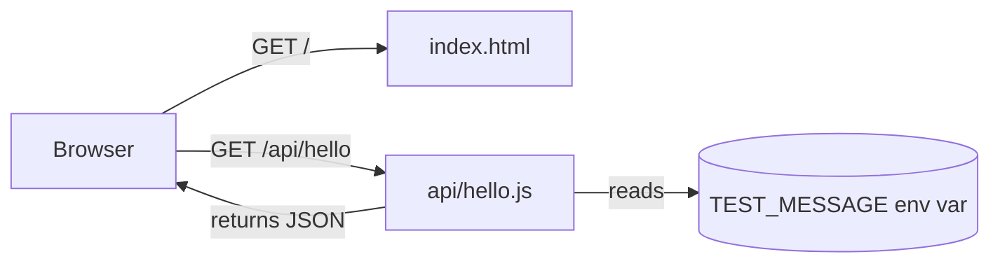

<p align="center">
  <h1 align="center">activity-logs-test</h1>
  <p align="center"><em>A disposable Vercel project with nothing to protect — built to trigger and observe Activity Log events.</em></p>
</p>

<p align="center">
  
  
  
  
</p>

<p align="center">
  <a href="https://vercel.com/new/clone?repository-url=https://github.com/kwyj1bo/acitivity-logs-test/tree/bhargavi">
    
  </a>
</p>

---

## 📖 Overview

This repo is a minimal sandbox for exercising Vercel's **Activity Log** — the audit trail of everything that happens to a project (deploys, env var changes, domain changes, access toggles, and more). There's nothing of value here; it exists so you can safely fire off real events and see how they show up in the timeline.

## 📑 Table of Contents

- [What's Inside](#-whats-inside)
- [How It Works](#-how-it-works)
- [Getting Started](#-getting-started)
- [Environment Variables](#-environment-variables)
- [API Reference](#-api-reference)
- [Activity Log Testing Checklist](#-activity-log-testing-checklist)
- [Tech Stack](#-tech-stack)

## 📁 What's Inside

| File | Purpose |
|---|---|
| `index.html` | Static homepage with a link to the API endpoint |
| `api/hello.js` | Serverless function that echoes `TEST_MESSAGE` — makes env-var edits visible after redeploy |
| `vercel.json` | Minimal zero-build Vercel config |
| `.env.example` | Sample environment variable for local reference |

## 🔄 How It Works



Every redeploy, env var change, or config toggle you make shows up as an event in **Project → Activity Log** on Vercel.

## 🚀 Getting Started

### Prerequisites
- [Node.js](https://nodejs.org/) and npm
- [Vercel CLI](https://vercel.com/docs/cli) — `npm i -g vercel`
- Project linked to Vercel — `vercel link`

### Run locally
```bash
npm install
npm run dev
```
This runs `vercel dev`, serving `index.html` and `/api/hello` locally at `http://localhost:3000`.

### Deploy
```bash
vercel        # → preview deployment
vercel --prod # → production deployment
```

## 🔑 Environment Variables

| Variable | Description | Example |
|---|---|---|
| `TEST_MESSAGE` | Returned by `/api/hello`; used to test env-var add / edit / delete events | `hello from production` |

Set it under **Project Settings → Environment Variables**, then redeploy. See [`.env.example`](.env.example) for the format.

## 📡 API Reference

### `GET /api/hello`

Returns the current environment and deployment context.

**Response**
```json
{
  "message": "hello from production",
  "region": "iad1",
  "deployedAt": "2026-08-27T12:00:00.000Z"
}
```

| Field | Description |
|---|---|
| `message` | Value of `TEST_MESSAGE`, or a fallback notice if unset |
| `region` | Vercel function region (`VERCEL_REGION`) |
| `deployedAt` | ISO timestamp generated at request time |

## ✅ Activity Log Testing Checklist

<details open>
<summary><strong>🚢 Deployments</strong></summary>

- [ ] Deploy `main` to production
- [ ] Push to a branch (`feature/test-branch`) → preview deployment
- [ ] Delete an old deployment
- [ ] Roll back production to a previous deployment
</details>

<details open>
<summary><strong>🔑 Environment Variables</strong></summary>

- [ ] Add `TEST_MESSAGE` → redeploy → confirm it shows at `/api/hello`
- [ ] Edit the value → redeploy → confirm it changed
- [ ] Delete the env var
</details>

<details open>
<summary><strong>🌐 Domains & Access</strong></summary>

- [ ] Add a project domain / alias
- [ ] Remove a domain / alias
- [ ] Toggle Deployment Protection (Vercel Authentication)
- [ ] Create a shareable protection-bypass link
- [ ] Add a project member / collaborator
</details>

<details open>
<summary><strong>⚙️ Deploy Hooks & Function Config</strong></summary>

- [ ] Create a Deploy Hook, `curl` it to trigger a deploy without a push
- [ ] Delete the Deploy Hook
- [ ] Change Function Region / Memory / Max Duration for `api/hello.js`
</details>

## 🛠 Tech Stack

- **Frontend:** Static HTML, zero build step
- **Backend:** Vercel Serverless Functions (Node.js)
- **Dependencies:** None

---

<p align="center"><sub>Built to be broken. Redeploy freely.</sub></p>
